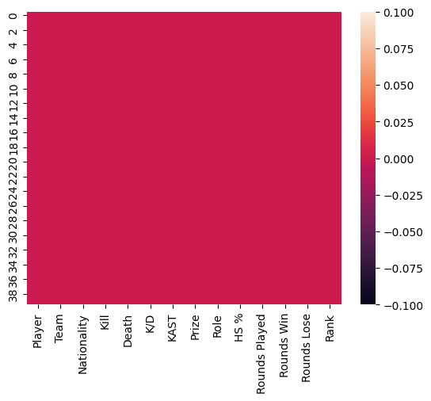
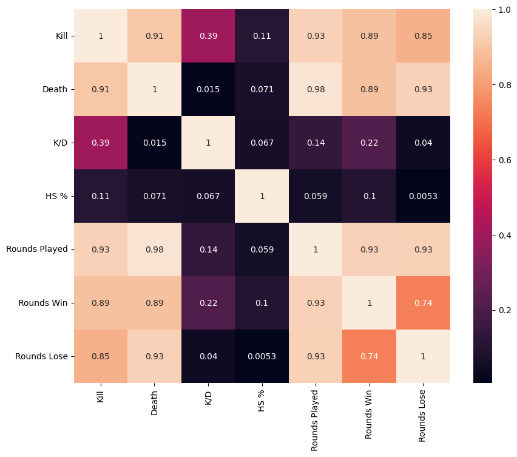
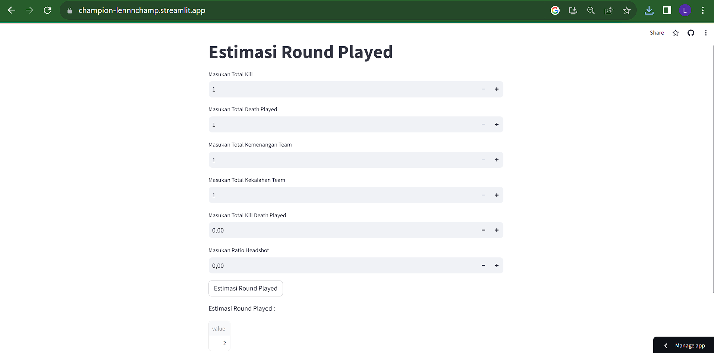

# Laporan Proyek Machine Learning

### Nama : Indra Setiawan

### Nim : 211351066

### Kelas : Pagi B

## Domain Proyek

Pengetahuan dan strategi yang diperlukan untuk berhasil dalam tournament

## Business Understanding

Untuk berhasil dalam dunia permainan profesional, perlu menguasai permainan tetapi juga mengembangkan pemahaman holistik tentang sisi bisnis dari dunia esports. Pengetahuan ini akan membantu mereka membuat keputusan yang terinformasi tentang karier mereka dan memastikan kesuksesan jangka panjang

Bagian laporan ini mencakup:

### Problem Statements

Player profesional esports sering kali dipenuhi dengan jadwal latihan yang intens dan kompetisi yang sering yang dapat menyebabkan "burnout," di mana pemain mengalami kelelahan fisik dan mental

### Goals

Memenangkan turnamen besar, seperti turnamen internasional atau turnamen berhadiah besar

### Solution statements

-Player dapat mengembangkan jadwal yang lebih terstruktur untuk menghindari kelelahan. Selain itu penting untuk merencanakan waktu istirahat dan latihan yang seimbang untuk menjaga kesejahteraan mental dan fisik.
-Industri esports harus menyediakan sumber daya dan layanan kesehatan mental yang lebih baik, termasuk konseling dan dukungan psikologis untuk pemain.

## Data Understanding

Dataset yang saya gunakan berasal jadi Kaggle yang berisi tentang Valorant Champions 2022 Istanbul.Dataset ini mengandung 162 baris dan 14 columns.

Selanjutnya menguraikan seluruh variabel atau fitur pada data

### Variabel-variabel pada Global Video Game Sales adalah sebagai berikut:

Player           (Menunjukan nama player)    (object)
Team             (Menunjukan nama team)    (object)
Nationality      (Menunjukan negara player)    (object)
Kill             (Menunjukan jumlah kill yang didapat player)    (int64)
Death            (Menunjukan total death player)    (int64)
K/D              (Menunjukan total kill dan death player)   (float64) 
KAST             (Menunjukan total kill, death, assist dan survival tracker)    (object)
Prize            (Menunjukan jumlah hadiah yang didapat juara)    (object)
Role             (Menunjukan role yang dimainkan player)    (object)
HS %             (Menunjukan headshot ratio player)    (float64)
Rounds Played    (Menunjukan total permainan)    (int64)
Rounds Win       (Menunjukan total kemenangan yang dimainkan)    (int64)
Rounds Lose      (Menunjukan total kekalahan yang di mainkan)    (int64)
Rank             (Menunjukan peringkat team)    (object)

## Data Preparation

### Data Collection

Untuk data collection ini, saya mendapatkan dataset dari website kaggle

### Data Discovery And Profiling

Untuk bagian ini, Pertama kita mengimport semua library yang dibutuhkan dan mendownload token kaggle akun kita,

```bash
import pandas as pd
import numpy as np
import seaborn as sns
import matplotlib.pyplot as plt
from sklearn.model_selection import train_test_split
from sklearn.linear_model import LinearRegression
```

Karena kita menggunakan google colab untuk mengerjakannya maka kita akan import files juga,

```bash
from google.colab import files
```

Lalu mengupload token kaggle agar nanti bisa mendownload sebuah dataset dari kaggle melalui google colab

```bash
file.upload()
```

Setelah mengupload filenya, lanjut dengan membuat sebuah folder untuk menyimpan file kaggle.json yang sudah diupload tadi

```bash
!mkdir -p ~/.kaggle
!cp kaggle.json ~/.kaggle/
!chmod 600 ~/.kaggle/kaggle.json
!ls ~/.kaggle
```

lalu kita download datasetsnya

```bash
!kaggle datasets download -d mohannapd/mobile-price-prediction --force
```

Selanjutnya extract file yang tadi telah didownload

```bash
!mkdir -p shihouinyoruichi/valorant-champions-2022-istanbul-stats
!unzip valorant-champions-2022-istanbul-stats.zip -d shihouinyoruichi/valorant-champions-2022-istanbul-stats
!ls shihouinyoruichi/valorant-champions-2022-istanbul-stats
```

Lanjut dengan memasukkan file csv yang telah diextract pada sebuah variable, dan melihat 5 data paling atas dari datasetsnya

```bash
df = pd.read_csv('/content/shihouinyoruichi/valorant-champions-2022-istanbul-stats/valorant champions istanbul.csv')
df.head()
```

Untuk melihat mengenai type data dari masing masing kolom kita bisa menggunakan property info,

```bash
df.info()
```

Selanjutnya kita akan memeriksa apakah datasetsnya terdapat baris yang kosong atau null dengan menggunakan seaborn,

```bash
sns.heatmap(df.isnull())
```

 <br>

kita deskripsikan terlebih dahulu,

```bash
df.describe()
```

Lanjut dengan data exploration kita,

```bash
plt.figure(figsize=(10,8))
sns.heatmap(df.corr(), annot=True)
```



## Modeling

Langkah pertama memasukkan kolom-kolom fitur yang ada di datasets dan juga kolom targetnya,

```bash
features = [ 'Kill', 'Death', 'Rounds Win', 'Rounds Lose', 'K/D', 'HS %']
x = df[features]
y = df['Rounds Played']
x.shape, y.shape
```

Selanjutnya kita tentukan berapa persen dari datasets yang akan digunakan untuk test dan untuk train

```bash
x_train, X_test, y_train, y_test = train_test_split(x, y, random_state=70)
y_test.shape
```

lalu buat mode dan memasukkan X_train dan y_train pada model dan memasukkan value predict pada y_pred,

```bash
lr = LinearRegression()
lr.fit(x_train,y_train)
pred = lr.predict(X_test)
```

sekarang kita bisa melihat score dari model yang sudah dibuat,

```bash
score = lr.score(X_test, y_test)
print('akurasi model regresi linier = ', score)
```

Bagus, 100%, kita test menggunakan array value

```bash
input_data =np.array([[188,89,160,72,1.40,30.30]])
prediction=lr.predict(input_data)
print('Estimasi Rounds Played : ',prediction)
```

berhasil!!, modelnya sudah selesai, selanjutnya kita export sebagai sav agar nanti bisa kita gunakan pada project web streamlit kita.

```bash
import pickle

filename = 'Estimasi_Round_Played.sav'
pickle.dump(lr,open(filename,'wb'))
```

## Evaluation

Disini saya menggunakan F1 score sebagai metrik evaluasi.

F1 Score: F1 score adalah rata-rata harmonis antara presisi dan recall. F1 score memberikan keseimbangan antara presisi dan recall. F1 score dihitung dengan menggunakan rumus: 2*(P*R/P+R)
```bash
from sklearn.metrics import precision_recall_curve, f1_score

threshold = 0.5

y_pred_binary = (pred > threshold).astype(int)
y_test_binary = (y_test > threshold).astype(int)

f1 = f1_score(y_test_binary, y_pred_binary)

print('f1 Score :', f1)
```
Hasil yang didapat adalah 1.0 atau 100%. Jadi, model ini memiliki keseimbangan yang sangat baik antara presisi dan recall.

## Deployment

[My Estimation App](https://champion-lennnchamp.streamlit.app/).



##
